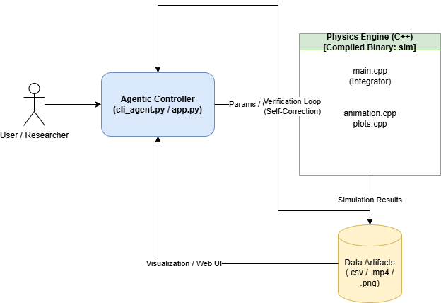

## SYSTEH SETUP

```
./setup_system.sh
```

https://aistudio.google.com/projects

```
export GEMINI_API_KEY=<downloaded Key from google ai studio>
```

### 1. The Agentic Quantitative Trading Swarm (The Finance Play)

Building a trading bot is a classic engineer side project, but doing it with an Agentic AI swarm makes it a modern, complex distributed systems problem.

* *The Concept:* Instead of a single script, you build a multi-agent system using LangGraph or Pydantic AI.
* *The Architecture:* You create specialized agents. One agent pulls and reads financial news/sentiment. Another agent (the "Quant") autonomously writes and backtests Python code for trading strategies based on that news. A third agent (the "Risk Manager") reviews the backtest results and decides whether to simulate a paper trade.
* *Why it's fun:* It is pure data, APIs, and Python. It challenges you to build a reliable system where AI agents argue with each other to reach a consensus before executing a programmatic action.

### 2. Natural Language to Physics Simulator (The Compute Heavyweight)



Take advantage of high-performance C++ and Python by building an agent that bridges the gap between natural language and complex mathematical simulations.

* *The Concept:* You build an Agentic AI where a user can type, "Simulate the thermodynamic cooling of a multi-layer titanium cylinder in a vacuum," and the agent autonomously writes the code to simulate it, runs it, and returns the visualization.
* *The Architecture:* The agent acts as a compiler. It interprets the physics constraints, writes the raw C++ or Python simulation code, executes it in a sandboxed environment, catches any compilation or math errors, rewrites the code to fix them, and outputs the final plots.
* *Why it's fun:* It leans heavily into computational physics and deep software engineering. You get to play with the boundary of having an LLM write executable, mathematically sound code that interfaces with rendering or plotting libraries.

### 3. The Autonomous Signal & Audio Detective (The Data Cruncher)

Dealing with massive, messy time-series data or audio files is universally painful. Build an agentic system that acts as an autonomous data scientist.

* *The Concept:* A tool where you dump gigabytes of unstructured time-series data or audio logs into a folder. The agent explores the data, identifies anomalies, and autonomously writes digital signal processing (DSP) scripts to clean or classify the noise.
* *The Architecture:* The system would involve an orchestrator agent that chunks the data, delegates it to worker agents to run Fast Fourier Transforms (FFTs) or generate spectrograms, and then synthesizes the findings into a human-readable dashboard.
* *Why it's fun:* It utilizes signal processing, backend architecture, and pattern recognition without needing a single physical sensor. It is a fantastic excuse to build a highly concurrent backend in C++ or Python.
